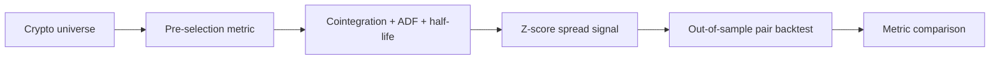
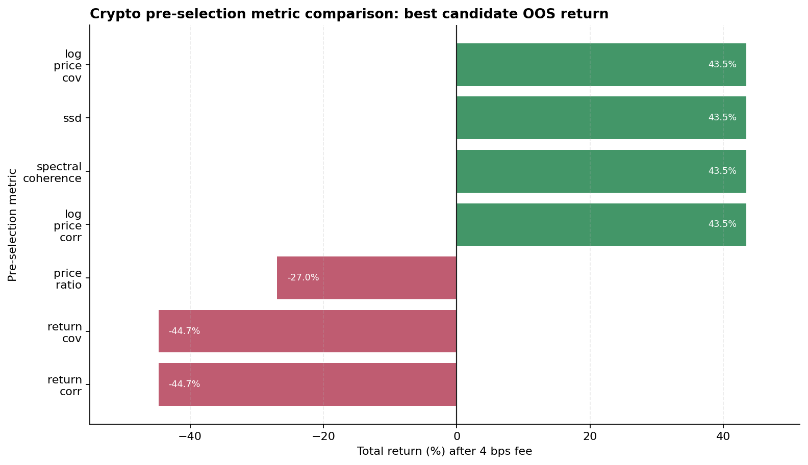

Trong pairs trading, câu hỏi đơn giản nhất là: hai tài sản có cointegrated không? Nhưng trong một universe lớn, câu hỏi đó chưa phải điểm bắt đầu. Trước khi chạy cointegration test, ta phải quyết định cặp nào đáng được đưa vào list để kiểm định. Bước này được gọi là pre-selection, và paper *Pre-selection in cointegration-based pairs trading* của Brunetti và De Luca cho thấy nó không chỉ là tối ưu tốc độ tính toán. Metric pre-selection có thể làm thay đổi chính cặp được trade, lợi nhuận, độ biến động của lợi nhuận và cả risk profile.

Thesis của bài này là: trong universe đủ rộng, pre-selection trở thành một phần của giả thuyết alpha. Correlation, distance, covariance hay spectral coherence không chỉ là một metric để lọc kỹ thuật vì mỗi metric này là một prior khác nhau về kiểu quan hệ mà ta tin rằng sẽ mean-revert.

## Bối cảnh phương pháp

Literature về non-ML pairs trading thường chia thành vài nhóm. Distance approach, chuẩn hóa hai chuỗi giá trong formation period rồi chọn những cặp có khoảng cách nhỏ nhất. Cách này nhanh, model-free và dễ mở rộng, nhưng nó không bảo đảm spread có quan hệ cân bằng dài hạn bởi hai tài sản có thể đi gần nhau trong một giai đoạn chỉ vì cùng beta thị trường.

Nhóm thứ 2, cũng là nội dung chính của bài, Cointegration approach. Với hai chuỗi log-price \(p_1\) và \(p_2\), ta tìm một tổ hợp tuyến tính:

$$
spread_t = p_{1,t} - (\mu + \beta p_{2,t})
$$

Nếu spread này stationary, deviation khỏi cân bằng được xem là tạm thời về mặt thống kê. 

Trong bài này, Brunetti và De Luca tập trung vào một điểm ít được làm rõ: nếu cùng dùng cointegration strategy, việc pre-select bằng metric khác nhau có tạo ra kết quả khác nhau không? Paper so sánh bảy metric gồm SSD, price ratio, log-price correlation, return correlation, log-price covariance, return covariance và spectral coherence. Kết luận chính là "pre-selection matters", pre-selection metrics làm kết quả cuối cùng khác đáng kể, kể cả sau commission, cut rules, market impact và khi dùng kiểm định cointegration thay thế.

## Pipeline

Flow trong bài replication này được giữ gần giống với paper: formation period dùng để xếp hạng cặp, cointegration và diagnostic thống kê; trading period dùng để kiểm tra tín hiệu.



Phần pre-selection trả lời câu hỏi: metric nào đưa cặp vào danh sách kiểm định? Với SSD và price ratio, score nhỏ hơn thường tốt hơn; với correlation, covariance và spectral coherence, score lớn hơn được ưu tiên. Logic cốt lõi của metric được giữ trong một hàm nhỏ:

```python
def _preselection_value(metric, log_a, log_b, idx_a, idx_b, ret_a, ret_b) -> float:
    if metric == "ssd":
        return float(((idx_a - idx_b) ** 2).sum())
    if metric == "price_ratio":
        ratio = idx_a.div(idx_b.replace(0, np.nan)).dropna()
        return float(abs(ratio.mean() - 1.0))
    if metric == "log_price_corr":
        return float(abs(log_a.corr(log_b)))
    if metric == "return_corr":
        return float(abs(ret_a.corr(ret_b)))
```

Sau pre-selection, ta kiểm tra xem spread có stationary không. Hedge ratio được ước lượng bằng OLS trên formation window, rồi residual được dùng cho ADF và half-life để trả lời cho 2 câu hỏi “hai tài sản có liên quan không” và “spread có cấu trúc mean-reverting đủ hợp lý để trade không”.

```python
def hedge_ratio(y: pd.Series, x: pd.Series) -> float:
    frame = pd.concat([y, x], axis=1).dropna()
    model = sm.OLS(frame.iloc[:, 0], sm.add_constant(frame.iloc[:, 1])).fit()
    return float(model.params.iloc[1])


def spread_from_beta(price_a: pd.Series, price_b: pd.Series, beta: float) -> pd.Series:
    return price_a - beta * price_b


def half_life(spread: pd.Series) -> float:
    aligned = pd.concat([spread.diff(), spread.shift(1)], axis=1).dropna()
    model = sm.OLS(aligned.iloc[:, 0], sm.add_constant(aligned.iloc[:, 1])).fit()
    phi = model.params.iloc[1]
    return float(-np.log(2) / phi) if phi < 0 else np.inf


def cointegration_candidates(prices: pd.DataFrame, ranked_pairs: pd.DataFrame) -> pd.DataFrame:
    log_prices = np.log(prices)
    records = []
    for row in ranked_pairs.itertuples(index=False):
        symbol_a, symbol_b = row.symbol_a, row.symbol_b
        pair = log_prices[[symbol_a, symbol_b]].dropna()
        test_stat, pvalue, _ = coint(pair[symbol_a], pair[symbol_b])
        beta = hedge_ratio(pair[symbol_a], pair[symbol_b])
        spread = spread_from_beta(pair[symbol_a], pair[symbol_b], beta)
        adf_pvalue = adfuller(spread.dropna(), autolag="AIC")[1]
        hl = half_life(spread)
        if pvalue <= 0.10 and adf_pvalue <= 0.05 and 12 <= hl <= 240:
            records.append(
                {
                    "rank": row.rank, "symbol_a": symbol_a, "symbol_b": symbol_b,
                    "pvalue": pvalue, "adf_pvalue": adf_pvalue,
                    "half_life": hl, "hedge_ratio": beta,
                }
            )
    return pd.DataFrame(records).head(MAX_COINTEGRATED_PAIRS)

```


Trading logic dùng z-score của spread: vào lệnh khi \(|z|$\ge$2\), thoát khi spread quay về 0, stop khi \(|z|$\ge$4\), nếu không thì sẽ đóng lệnh sau 336 bar.

## Minh họa thực nghiệm

Case study local dùng crypto perpetual 1h. Formation window là 4.320 bar, xấp xỉ 180 ngày. Trading period là phần còn lại của dữ liệu. Universe được cố định gồm 15 perpetual thanh khoản cao từ case crypto trước đó. Với mỗi metric, code xét tối đa 25 cặp pre-selection và giữ tối đa 4 candidate cointegrated sau filter. Các tham số tín hiệu là z-score window 72 bar, entry 2, exit 0, stop 4, max holding 336 bar và fee 4 bps.

Bảng dưới đây là best-pair so sánh bằng OOS return theo từng metric:

| Pre-selection | Best candidate | Total return | Sharpe | Max drawdown | Trades |
|---|---|---:|---:|---:|---:|
| Log-price correlation | `1000SHIB/GALA` | 43,45% | 0,44 | -72,94% | 615 |
| Log-price covariance | `1000SHIB/GALA` | 43,45% | 0,44 | -72,94% | 615 |
| SSD | `1000SHIB/GALA` | 43,45% | 0,44 | -72,94% | 615 |
| Spectral coherence | `1000SHIB/GALA` | 43,45% | 0,44 | -72,94% | 615 |
| Price ratio | `GALA/XRP` | -26,95% | -0,06 | -62,99% | 567 |
| Return covariance | `BNB/ETH` | -44,74% | -0,70 | -50,58% | 515 |
| Return correlation | `BNB/ETH` | -44,74% | -0,70 | -50,58% | 515 |



Kết quả này cho thấy pre-selection tác động tới việc lựa chọn cặp trade. Nhóm log-price correlation, log-price covariance, SSD và spectral coherence đều đưa `1000SHIB/GALA` vào vùng đáng chú ý. Trong mẫu này, cặp này cho total return dương, nhưng drawdown gần 73% và hơn 600 trades cho thấy edge rất mỏng và rủi ro execution lớn.

Ngược lại, return correlation và return covariance chọn `BNB/ETH`, một cặp nghe hợp lý vì hai tài sản lớn thường đi cùng nhịp thị trường. Tuy nhiên, cặp này âm mạnh sau fee. Do đó có thể thấy return co-movement ngắn hạn phản ánh beta chung hơn là một spread cân bằng có thể khai thác. Price ratio chọn `GALA/XRP` cho kết quả âm tương tự.

Thêm quan sát nữa là p-value không xếp hạng PnL tốt. Ví dụ cụ thể trong nhóm log-price correlation, `DOGE/SOL` có p-value tốt hơn `1000SHIB/GALA` nhưng OOS lại âm nặng. Điều này đúng theo nhận định của paper khi nói statistical validity không phản ánh đúng tradability.

## Tạm kết

Pre-selection trong cointegration pairs trading là một cách chọn cặp tài sản vào nghiên cứu. Return correlation sẽ ưu tiên tài sản đồng biến ngắn hạn. Distance hoặc log-price correlation ưu tiên đường giá có hình dạng gần nhau hơn. Spectral coherence ưu tiên common movement theo miền tần số.

Để hoàn thiện strategy này, các bước tiếp theo là rolling re-selection nhiều cửa sổ, ranking bao gồm fee trong formation, kiểm tra fee sensitivity, slippage/funding, và portfolio-level aggregation thay vì chọn best pair bằng OOS return. 

## References

Brunetti and De Luca (2023), *Pre-selection in cointegration-based pairs trading*; Gatev, Goetzmann and Rouwenhorst (2006); Engle and Granger (1987); Johansen (1988); Vidyamurthy (2004); Krauss (2017); Miao (2014); Rad, Low and Faff (2016).
